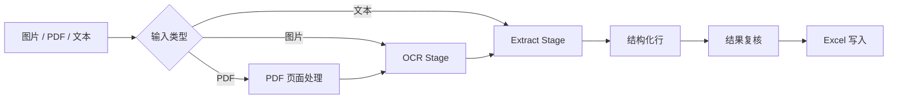

# OCR Extract Project

把图片、PDF 或文本里的非结构化内容变成可复核、可导出的 Excel 表格。这个项目是一个 PySide6 桌面应用：先用 PaddleOCR 或在线 OCR 读取文档，再用 OpenAI 兼容接口或 Ollama 按业务模板抽取字段，最后把结果写入 `.xlsx`。

[](https://www.python.org/)
[](LICENSE)

> Windows 用户如果只想使用成品包，可以查看 [GitHub Releases](https://github.com/jianyangle/ocr-llm-extract/releases)。源码运行和打包请按下文操作。


## 适合处理什么

- 批量处理发票、名片、邮件签名、联系人信息等版式文档。
- 从扫描图、照片、PDF 或纯文本中抽取固定列。
- 用一份 `prompt + examples` 定义自己的表头和抽取规则。
- 在导出 Excel 前人工复核 OCR 原文、抽取结果和原文溯源状态。

## 核心能力

| 能力 | 当前实现 |
| --- | --- |
| 输入来源 | 图片、PDF、纯文本 |
| 本地 OCR | `paddlepaddle==3.0.0` + `paddleocr==3.2.0`，模型位于 `models/` |
| 在线 OCR | 百度 PaddleOCR AI Studio 异步任务，支持表格、公式、图表、印章识别开关 |
| PDF 处理 | 文本层优先，必要时渲染页面并走 OCR；默认限制 30 页、20 MB、200 DPI |
| 抽取后端 | OpenAI 兼容接口或本地 Ollama |
| 抽取模板 | 内置“发票抽取”和“名片抽取”，支持用户自定义模板 |
| 结构化输出 | 根据示例表头生成 JSON Schema，减少列错位 |
| 原文溯源 | 支持 `off` / `balanced` / `strict` 三档 grounding 模式 |
| 结果复核 | 任务队列、逐页结果、跳过行、重试失败任务、写入 Excel |

## 快速开始

### 环境要求

- Python 3.12
- Windows 或 Linux / WSL；macOS 未在仓库文档中声明为已验证平台
- 一个可用的 LLM 后端：
  - OpenAI 兼容 API，例如硅基流动、DeepSeek、智谱、月之暗面、火山引擎、MiniMax、腾讯混元、阿里云百炼或自定义地址
  - 或本地 [Ollama](https://ollama.com/)

### Windows PowerShell

```powershell
git clone https://github.com/jianyangle/ocr-llm-extract.git
cd ocr-llm-extract

py -3.12 -m venv .venv
.\.venv\Scripts\python -m pip install -r requirements.txt
.\.venv\Scripts\python src\app.py
```

### Linux / WSL

```bash
git clone https://github.com/jianyangle/ocr-llm-extract.git
cd ocr-llm-extract

python3.12 -m venv .venv
.venv/bin/python -m pip install -r requirements.txt
.venv/bin/python src/app.py
```

首次安装会拉取 Paddle、Qt、OpenCV 等较大的依赖。运行源码时，本地 OCR 模型从仓库根目录的 `models/` 读取；打包后模型从 PyInstaller 的 `_MEIPASS/models` 读取。

## 首次配置

启动应用后进入设置页，至少完成 LLM 后端配置。

| 配置项 | 说明 |
| --- | --- |
| `provider_platform_id` | 选择模型平台；内置平台包括 `silicon`、`deepseek`、`ollama`、`zhipu`、`moonshot`、`doubao`、`minimax`、`hunyuan`、`dashscope`、`custom` |
| `base_url` | OpenAI 兼容接口地址或 Ollama 地址，Ollama 默认 `http://localhost:11434` |
| `api_key` | 云端模型通常必填，Ollama 不需要 |
| `model` | 要调用的模型名；设置页可测试连接和拉取模型列表 |
| `ocr_use_online` | 是否切换为在线 OCR；默认关闭，使用本地 PaddleOCR |
| `default_excel_path` | Excel 默认输出路径；未配置时使用项目目录下的 `example.xlsx` |

配置文件保存到用户主目录的 `.ocr_extract_app/config.json`。完整高级配置见 [docs/claude/configuration-advanced.md](docs/claude/configuration-advanced.md)。

## 基本使用流程

1. 点击添加文件或添加文本，把图片、PDF 或文本加入任务队列。
2. 在顶部模板下拉框选择抽取模板；默认模板来自 `src/extract/builtin_templates.py`。
3. 队列空闲时新增任务会处于 `paused` 状态；点单行“继续任务”运行单个任务，或点“全部开始”批量运行。
4. 在结果区复核抽取行；不需要导出的行可以标记为跳过。
5. 写入 Excel。应用会追加写入目标 `.xlsx`，并过滤被跳过的行和错误行。

## 自定义抽取模板

模板由自然语言指令和二维表示例组成。示例第一行就是输出表头，应用会用它生成结构化输出约束。

```text
Prompts:
从用户提供的发票 OCR 文本中提取结构化字段。
输出顺序必须为：发票号码、开票日期、购买方名称、金额、税率、销售方名称。
同一段文本中可能包含多张发票，应逐张输出多行。
缺失字段使用单个空格字符串 " " 占位。

Examples:
[
  ["发票号码", "开票日期", "购买方名称", "金额", "税率", "销售方名称"],
  ["56115415", "2023年07月03日", "塔塔气体有限公司", "211.33", "6%", "顺丰速运重庆有限公司"]
]
```

内置模板位于 `src/extract/builtin_templates.py`。发票模板还带有字段类型、行规则、区域定位和买卖方字段组配置，用于金额行拆分、类型归一化、区域补救 OCR 和买卖方错位纠正。

## 数据流



本地 OCR 路径使用 `RoutingOCRService -> PaddleOCRService -> TBPU`。在线 OCR 路径使用百度 PaddleOCR AI Studio 的整文档异步任务，返回的 Markdown 文本会直接进入抽取阶段。更完整的分层说明见 [docs/claude/architecture-reference.md](docs/claude/architecture-reference.md)。

## 项目结构

```text
src/
├── app.py                  # 桌面应用入口和依赖装配
├── core/                   # 任务队列、OCR/Extract 流水线、PDF 聚合
├── domain/                 # AppConfig、TaskItem、ExtractRow 等数据模型
├── extract/                # LLM 适配器、prompt、schema、模板、grounding
├── io/                     # 配置、日志、Excel 写入
├── ocr/                    # 本地 OCR、在线 OCR、PDF adapter、TBPU 后处理
├── ops/                    # OCR 评估、性能/可靠性辅助工具
├── release/                # 发布打包辅助代码
└── ui/                     # PySide6 主窗口、设置页、主题和控件

models/                     # 本地 OCR 模型
data/fonts/                 # 内嵌字体
data/icons/                 # 应用图标资源
requirements.txt            # Python 运行依赖
docs/screenshot.png         # README 展示截图
docs/claude/                # 架构、配置、打包等公开文档
```

## 打包发布

Windows 目标使用 PyInstaller。仓库已固定 `pyinstaller==6.21.0`，并在 [docs/claude/build-packaging.md](docs/claude/build-packaging.md) 记录完整命令和每个参数的原因。

请按 [docs/claude/build-packaging.md](docs/claude/build-packaging.md) 中的完整命令打包。该命令显式收集 Paddle、PaddleOCR、PaddleX、OCR 模型、字体和图标资源，避免冻结包运行时缺少模型或元数据。

打包验收至少要检查：

- `dist/OCRExtract/OCRExtract.exe` 能启动主窗口。
- 任务栏和 Alt+Tab 显示应用图标。
- 本地 OCR 能加载 `models/PP-OCRv5_mobile_det`、`models/PP-OCRv5_mobile_rec`、`models/PP-LCNet_x1_0_textline_ori`、`models/PP-LCNet_x1_0_doc_ori`。
- 设置页 provider logo、工具栏图标和字体没有丢失。

## 常见问题

<details>
<summary>为什么建议用项目里的 `.venv` 运行应用？</summary>

PySide6、PaddleOCR 和 OpenCV 都依赖本机动态库。使用系统 Python 时，可能出现 `ImportError: DLL load failed while importing QtWidgets` 这类环境错误。优先使用本 README 中的 `.venv` 命令。

</details>

<details>
<summary>没有 LLM API key 能不能运行？</summary>

可以启动应用，也可以配置本地 Ollama；但真正执行抽取需要一个可用模型。测试代码本身大量使用 stub，不要求真实 LLM 服务。

</details>

<details>
<summary>PDF 是直接读文字还是整页 OCR？</summary>

默认优先使用 PDF 文本层。文本层不足、需要归因或抽取为空时，流水线会按配置走页面渲染和 OCR 兜底。相关参数包括 `pdf_prefer_text_layer`、`pdf_text_layer_min_chars`、`pdf_text_layer_completeness_ocr` 和 `pdf_text_layer_attribution_ocr`。

</details>

## 文档入口

- [docs/claude/architecture-reference.md](docs/claude/architecture-reference.md)：架构和模块分层。
- [docs/claude/configuration-advanced.md](docs/claude/configuration-advanced.md)：高级配置字段。
- [docs/claude/build-packaging.md](docs/claude/build-packaging.md)：Windows 打包说明。
- [docs/source-runtime-compatibility-checklist.md](docs/source-runtime-compatibility-checklist.md)：源码运行兼容性检查清单。

## 许可证与来源

本项目使用 [MIT License](LICENSE)。

`src/ocr/tbpu/` 中的文本块后处理算法移植自 [Umi-OCR](https://github.com/hiroi-sora/Umi-OCR)，源文件注释标注为 MIT License，作者为 hiroi-sora。

主要依赖包括 [PaddleOCR](https://github.com/PaddlePaddle/PaddleOCR)、[PySide6](https://doc.qt.io/qtforpython/)、[openpyxl](https://openpyxl.readthedocs.io/) 和 [pypdfium2](https://pypdfium2.readthedocs.io/)。
