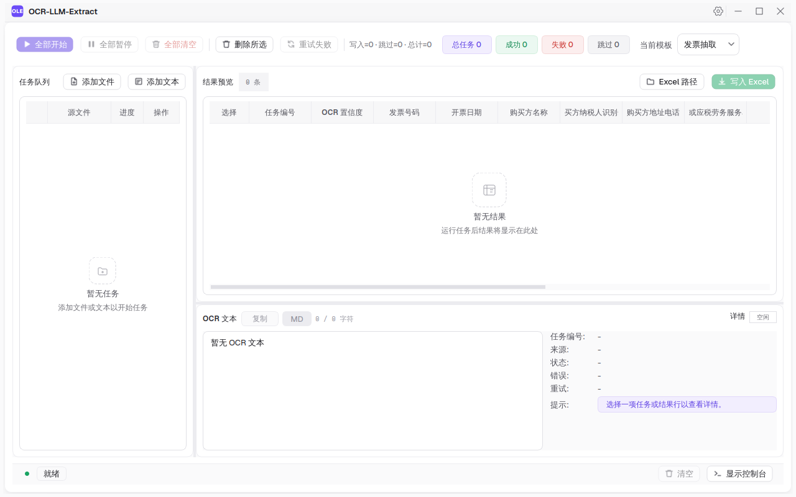

# OCR Extract Project

> 导入图片 / PDF / 文本 → OCR 识别 → LLM 按你定义的规则提取结构化数据 → 写入 Excel。



PySide6 桌面应用，用于批量处理**发票、名片**等版式文档。OCR 把图像转成文字，LLM 按你配的 prompt 和示例把文字整理成表格行，追加写入 `.xlsx`。

- **本地优先**：OCR 用 PaddleOCR，模型随仓库提供，开箱即用。
- **规则可自定义**：用「prompt + examples」定义任意输出列，应用自动生成 JSON Schema 约束 LLM。
- **LLM 后端灵活**：OpenAI 兼容 API 或本地 Ollama，二选一。
- **可选在线 OCR**：复杂版面可切换百度 AI Studio 托管 OCR。

---

## 功能特性

| 能力 | 说明 |
|------|------|
| 多种输入 | 单张图片、PDF（自动逐页处理，支持原生文本层与栅格化）、纯文本 |
| 本地 OCR | PaddleOCR 3.2.0（检测 / 识别 / 方向校正 / 去畸变），fast / balanced / accurate 三档 |
| 在线 OCR（可选） | 百度 AI Studio 托管，适合复杂版面与表格 |
| 版面后处理 | TBPU 引擎：旋转校正、阅读排序、段落判定、跨栏分隔 |
| 自定义抽取模板 | 用「prompt + examples」定义输出列，自动生成 JSON Schema 约束 LLM |
| LLM 后端 | OpenAI 兼容 API / Ollama，纯 REST 调用 |
| 原文溯源（Grounding） | 抽取结果回溯到 OCR 原文，五级置信度标注，便于人工复核 |
| Excel 导出 | 追加写入 `.xlsx`，文件名自动去重 |
| 任务队列 | 多文件排队、暂停 / 继续 / 重试，逐任务或全部开始 |

## 工作原理

```
用户输入（图片 / PDF / 文本）
        │
        ▼
   ┌─────────── OCR Stage ───────────┐
   │  本地：PaddleOCR + TBPU 版面后处理 │   ← 把图像/PDF 转成文本
   │  在线：百度 AI Studio 异步 job     │
   └────────────────┬─────────────────┘
                    │  OCR Text
                    ▼
   ┌────────── Extract Stage ─────────┐
   │  按选定模板构建 prompt + JSON Schema │   ← 把文本整理成表格行
   │  调用 LLM（OpenAI 兼容 / Ollama）   │
   │  解析归一化 + 原文溯源 Grounding     │
   └────────────────┬─────────────────┘
                    │  结构化行 ExtractRow
                    ▼
         主窗口结果复核  +  写入 Excel
```

## 快速开始

### 环境要求

- **Python 3.12**
- 操作系统：Linux / Windows（源码运行兼容目标）；macOS 未验证
- LLM 后端：OpenAI 兼容 API key，**或**本地 [Ollama](https://ollama.com/)
- OCR 模型随仓库提供（`models/`，约 66MB），无需额外下载

### 安装

```bash
# 1. 克隆仓库
git clone https://github.com/jianyangle/ocr-llm-extract.git
cd ocr-llm-extract
```

Linux / WSL：

```bash
python3.12 -m venv .venv
source .venv/bin/activate
python -m pip install -r requirements.txt
python src/app.py
```

Windows PowerShell：

```powershell
py -3.12 -m venv .venv
.venv\Scripts\Activate.ps1
python -m pip install -r requirements.txt
python src/app.py
```

> 首次安装会拉取 `paddlepaddle` / `paddleocr` 等较大依赖，请耐心等待。

### 配置 LLM 后端

启动后打开 **设置** 对话框：

- **OpenAI 兼容**：填 `base_url`、`api_key`、`model`，点「测试连接」验证。
- **Ollama**：填本地地址（默认 `http://localhost:11434`）和模型名。

配置保存在用户主目录下的 `.ocr_extract_app/config.json`，API key 在日志中自动脱敏。

## 使用说明

1. **导入文件**：把图片 / PDF / 文本文件加入任务队列。
2. **选择抽取模板**：主窗口下拉框选择模板。内置 `sigcard`（名片）和 `invoice`（发票）；也可在设置中自建。
3. **开始任务**：点「继续任务」单独运行，或「全部开始」批量运行。
4. **复核结果**：右侧展示抽取结果，Inspector 显示 OCR 原文与溯源标注。
5. **导出**：结果追加写入 `.xlsx`。

### 自定义抽取模板格式

模板分两部分：**Prompts**（自然语言指令）和 **Examples**（二维数组，首行为表头）。表头决定输出列，应用据此生成 JSON Schema。

示例（发票抽取）：

```
Prompts:
从用户提供的发票 OCR 文本中提取结构化字段。
输出顺序必须为：发票号码、开票日期、购买方名称……
同一段文本中可能包含多张发票，应逐张输出多行。
缺失字段使用单个空格字符串 " " 占位。

Examples:
[
  ["发票号码", "开票日期", "购买方名称", "金额", "税率", "销售方名称"],
  ["56115415", "2023年07月03日", "塔塔气体有限公司", "211.33", "6%", "顺丰速运重庆有限公司"]
]
```

## 配置

全局配置存于用户主目录下的 `.ocr_extract_app/config.json`，常用字段：

| 字段 | 取值 | 说明 |
|------|------|------|
| `provider` | `openai_compatible` / `ollama` | LLM 后端 |
| `extraction_profile` | `fast` / `balanced` / `accurate` | 抽取质量档位 |
| `ocr_profile` | `fast` / `balanced` / `accurate` | OCR 质量档位 |
| `ocr_use_online` | bool | 切换本地 / 在线 OCR |
| `use_structured_output` | bool | 是否用 JSON Schema 约束输出 |
| `grounding_mode` | — | 原文溯源模式 |
| `pdf_max_pages` / `pdf_max_file_size` / `pdf_render_dpi` | 30 / 20MB / 200 | PDF 处理限制 |

## 项目架构

```
src/
├── app.py            # 应用入口
├── domain/           # 纯数据模型：AppConfig、TaskItem、ExtractRow…
├── core/             # 流水线引擎：TaskEngine / TaskOrchestrator / PDF 处理
├── ocr/              # OCR 子系统：本地 PaddleOCR、在线服务、TBPU 版面后处理
├── extract/          # 抽取子系统：模板、prompt 构建、LLM 适配器、Grounding
├── ui/               # PySide6 主窗口、设置对话框、Refined Light 主题
├── io/               # 配置 / Excel / 日志持久化
└── release/          # PyInstaller 打包
models/               # 本地 OCR 模型权重（随仓库提供）
data/fonts/           # 内嵌字体（Geist / JetBrains Mono）
data/icons/           # 界面图标
```

## 打包发布

> 本节是 Windows PyInstaller 打包参考，不属于 Linux/Windows 源码运行兼容验收。源码运行请按"快速开始"中的 Linux / WSL 或 Windows PowerShell 命令执行。

Windows 打包（PyInstaller）：

```bash
pyinstaller --noconfirm --windowed --name OCRExtract \
  --add-data "models/PP-OCRv5_mobile_det;models/PP-OCRv5_mobile_det" \
  --add-data "models/PP-OCRv5_mobile_rec;models/PP-OCRv5_mobile_rec" \
  --add-data "models/PP-LCNet_x1_0_textline_ori;models/PP-LCNet_x1_0_textline_ori" \
  --add-data "models/PP-LCNet_x1_0_doc_ori;models/PP-LCNet_x1_0_doc_ori" \
  --add-data "src/ui/assets/icons;src/ui/assets/icons" \
  src/app.py
```

## 许可证

本项目采用 [MIT License](LICENSE)。

`src/ocr/tbpu/` 版面后处理算法移植自 [Umi-OCR](https://github.com/hiroi-sora/Umi-OCR)（MIT），版权归原作者。

## 致谢

- [PaddleOCR](https://github.com/PaddlePaddle/PaddleOCR) — 本地 OCR 引擎（Apache-2.0）
- [Umi-OCR](https://github.com/hiroi-sora/Umi-OCR) — TBPU 版面后处理算法来源（MIT）
- [PySide6](https://doc.qt.io/qtforpython/) — 桌面 GUI 框架
